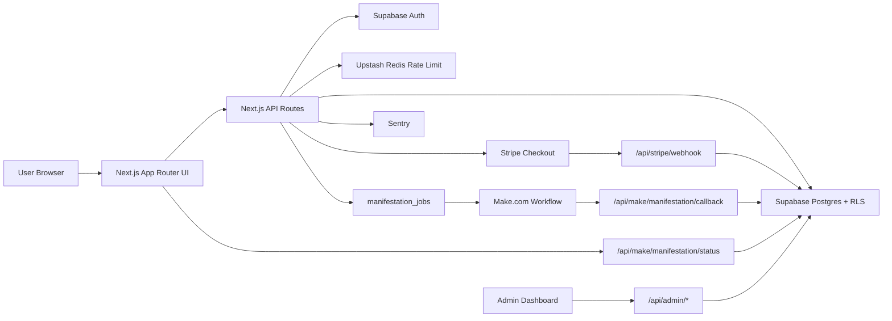

# Production Architecture

## Async Make Flow

1. User submits manifestation request.
2. API authenticates, validates, rate-limits, and reserves quota or paid entitlement.
3. API creates `manifestation_jobs` row.
4. API triggers Make with `jobId`, `callbackUrl`, and `callbackSecret`.
5. API returns `202` with `jobId`.
6. Frontend polls `/api/make/manifestation/status`.
7. Make posts result to `/api/make/manifestation/callback`.
8. Callback finalizes manifestation, stores result, and marks job completed.

